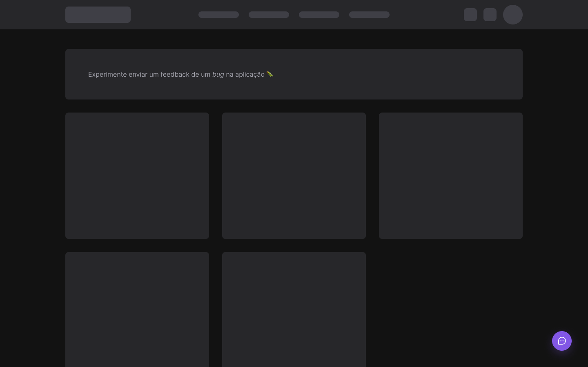
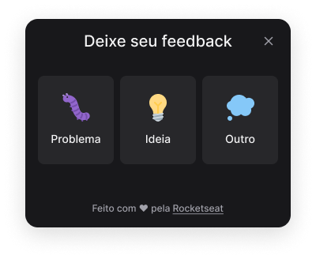
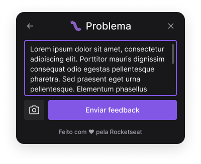
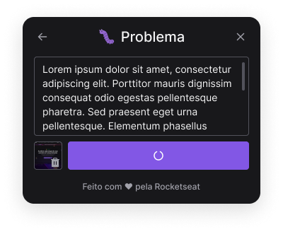
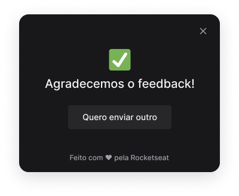
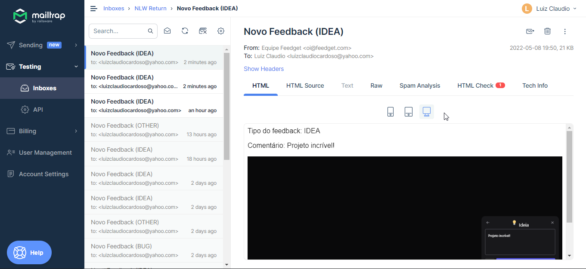
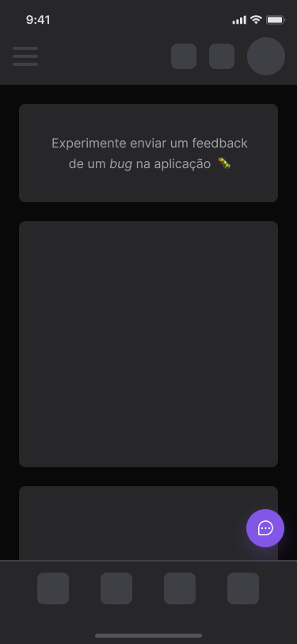
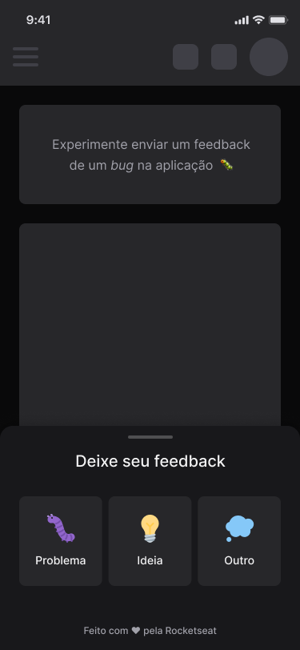
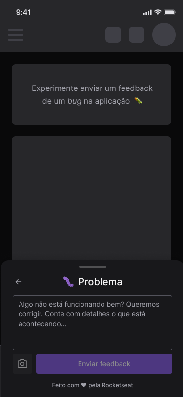
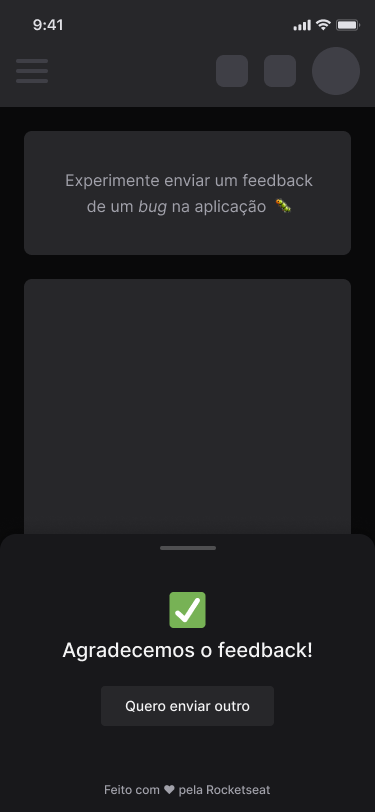

<h1> Projeto Next Level Week 8 - Return </h1>

## Fotos da aplicação:
 
<div>
    <h3>Web APP:</h3>
    
    <p style="display: flex; margin-top: 5px;" >
        
        
        
        
    </p>
    <hr/>
    <h3>Server (Database | Email):</h3>
    <p style="display: flex; margin-top: 20px" >
        
        
    </p>
    <hr/>
    <h3>Mobile APP:</h3>
    <p style="display: flex; margin-top: 20px">
        
        
        
        
    </p>  
    
</div>

## Technologies

This project was developed with the following technologies:

- [React](https://reactjs.org)
- [Tailwindcss](https://tailwindcss.com)
- [Vite](https://vitejs.dev)
- [TypeScript](https://www.typescriptlang.org)
- [Express](https://expressjs.com/pt-br)
- [Prisma](https://www.prisma.io)
- [Jest](https://jestjs.io)
- [React Native](https://reactnative.dev/)
- [Expo](https://expo.dev/)

## Instruções para visualizar o projeto

### Requerimentos

- [Node.js](https://nodejs.org/en/download/)

```bash
    # Clone Repository
    git clone https://github.com/AndersonAlvesCoelho/feedback-widget
    cd feedback-widget
```

#### 💻 Frontend

```bash
    cd /web
    #instale as dependências necessárias com:
    npm i
    #agora start o projeto
    npm run dev
```

#### 📦 Mobile

```bash
    cd /mobile
    #instale as dependências necessárias com:
    npm i
    #agora start o projeto
    npm run dev
```

#### 📦 Back end

```bash
    cd /back-end
    #instale as dependências necessárias com:
    npm i
    #agora start o projeto
    npm dev
```

---